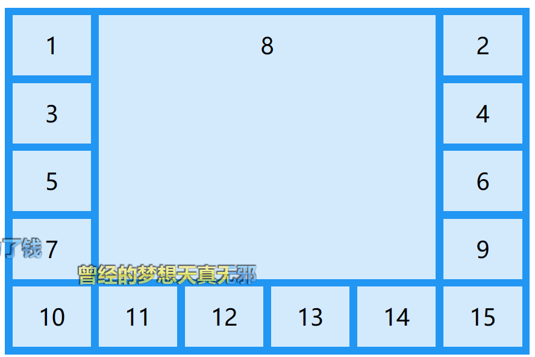

## 前言

> 什么是grid布局？ grid是css的一种属性，基于css的一种布局方式，它是以网格的形式进行的一种高级布局，强大之处可以实现任意效果的布局，flex不能实现的布局grid皆可实现。
CSS网格布局是一个二维的基于网格的布局系统, 其目的在于完全改变我们设计基于网络的用户界面的方式。CSS一直用来布局我们的网页, 但是他从来没有做过很好的工作, 最开始我们使用表格,然后float, position和inline-block。但是这些本质上是css的hack, 并且遗漏了很多重要的功能(例如垂直居中),后来flexbox出现了, 但是他的目的只是为了更简单的一维布局, 而不是复杂的二维布局。网格是第一个专门为解决布局问题而创建的CSS模块

## 网格容器grid

如需使 HTML 元素充当网格容器，您必须把 `display` 属性设置为 grid 或 inline-grid。

网格容器由放置在列和行内的网格项目组成。

- grid: 生成块级网格
- inline-grid: 生成内联网格
- subgrid: 如果你的网格容本身是一个网格项目(即嵌套网格), 你可以使用这个属性来表明你想继承他父母的行/列而不是他自己的。

### grid-template-columns , grid-template-rows（设置行列数）

>`grid-template-columns` 属性定义网格布局中的列数，并可定义每列的宽度，以空格分割
>
>如果您希望网格布局包含 4 列，请指定这 4 列的宽度；如果所有列都应当有相同的宽度，则设置为 "auto"。

`注意`:如果在 4 列网格中有 4 个以上的项目，则网格会自动分配在每一个项目中。

>`grid-template-rows` 属性定义网格布局中的行数,并可以定义每一列的高度，以空格分隔
>
>如果您希望网格布局包含 4 列，请指定这 4 列的宽度；如果所有列都应当有相同的宽度，则设置为 "auto"。

```html
<div class="grid-container">
  <div>1</div>
  <div>2</div>
  <div>3</div>  
  <div>4</div>
  <div>5</div>
  <div>6</div>  
  <div>7</div>
  <div>8</div>
</div>
```

```css
.grid-container {
  display: grid;
  grid-template-columns: auto auto auto auto;
  grid-template-rows:100px 200px 300px
}
.grid-container > div {
  background-color: rgba(255, 255, 255, 0.8);
  text-align: center;
  padding: 20px 0;
  font-size: 30px;
}
```

### grid-template-areas

>通过应用`grid-area`属性指定网格空间的名称来定义网格模板
>
>- : 指定的网格空间的名称`grid-area`
>- .: 表示一个空的网格单元
>- none: 没有定义网格空间

### justify-content

>`justify-content` 属性用于在容器内对齐整个网格
>
>`注意`：网格的总宽度必须小于容器的宽度，这样 justify-content 属性才能生效。
>
>- space-around: 会在列之间以及列周围留出相等的空间
>- space-between: 会在列之间以及列周围留出相等的空间
>- space-evenly: 会在列之间以及列周围留出相等的空间
>- center: 居中等分，会在容器中间对齐网格
>- start:会在容器开头对齐网格
>- end:会在容器末端对齐网格

### align-content

>*align-content* 属性用于垂直对齐容器内的整个网格
>
>`注意`网格的总高度必须小于容器的高度，这样 align-content 属性才能生效。
>
>- center:会对齐容器中间的行
>- space-evenly:将使行之间以及行周围具有相等的空间
>- space-around:将使行周围具有相等的空间
>- space-between: 将使两端的空间对齐
>- start:会对齐容器开头的行（垂直从上至下）
>- end:会对齐容器皆为的行（垂直从下至上）


## 网格布局模块

### 网格间隙（Grid Gaps）

>`每列/行之间的间隔称为间隙`
>
>可以通过使用以下属性之一来调整间隙大小：
>
>- `grid-column-gap` （设置列间隙大小）
>- `grid-row-gap` （设置行间隙大小）
>- `grid-gap` (复合属性:空格相隔) 50px  50px

#### grid-gap

>是`grid-row-gap 和 grid-column-gap 属性的简写属性`
>
>`grid-gap` 属性还可用于将行间隙和列间隙设置为一个值：

```css
.grid-container {
  display: grid;
  grid-gap: 50px 100px;
}
```

#### grid-column-gap

>属性设置列之间的间隙

```css
.grid-container {
  display: grid;
  grid-column-gap: 50px;
}
```

#### grid-row-gap

>属性设置行之间的间隙

```css
.grid-container {
  display: grid;
  grid-row-gap: 50px;
}
```

### 网格行（Grid Lines）

>列之间的线称为列线（column lines）。
>
>行之间的线称为行线（row lines）。

把网格项目放在列线 1，并在列线 3 结束它：

```css
.item1 {
  grid-column-start: 1;
  grid-column-end: 3;
}
```

把网格项目放在行线 1，并在行线 3 结束它：

```css
.item1 {
  grid-row-start: 1;
  grid-row-end: 3;
}
```

## 网格项目

### 子元素（项目）

>默认情况下，容器在每一行的每一列都有一个网格项目，但是您可以设置网格项目的样式，让它们跨越多个列和/或行。

#### grid-column

>`grid-column` 属性定义将项目放置在哪一列上
>
>**注释：**`grid-column` 属性是 grid-column-start 和 grid-column-end 属性的简写属性
>
>如需放置某个项目，您可以引用行号（line numbers），或使用关键字 "span" 来定义该项目将跨越多少列。

使 "item1" 从第 1 列开始并在第 5 列之前结束：

```css
.item1 {
    grid-column: 1 / 5;
}
```

使 "item1" 从第 1 列开始，并跨越 3 列 `(跨列表示不包含其实位置，跨几列)`

```
.item1 {
	grid-column: 1 / span 3;
}
```

#### grid-row

>`grid-row` 属性定义了将项目放置在哪一行。
>
>可以定义项目的开始位置以及结束位置
>
>`注释：`grid-row` 属性是 grid-row-start 和 grid-row-end 属性的简写属性。
>
>如需放置项目，可以引用行号，或使用关键字 "span" 定义该项目将跨越多少行

使 "item1" 在 row-line 1 开始，在 row-line 4 结束：

```css
.item1 {
  grid-row: 1 / 4;
}
```

使 "item1" 从第 1 行开始并跨越 2 行：

```
.item1 {
  grid-row: 1 / span 2;
}
```

#### grid-area

>`grid-area` 属性可以用作 grid-row-start、grid-column-start、grid-row-end 和 grid-column-end 属性的简写属性

使 "item8" 从 row-line 1 和 column-line 2 开始，在 row-line 5 和 column line 6 结束

```css
<div class="grid-container">
  <div class="item1">1</div>
  <div class="item2">2</div>
  <div class="item3">3</div>  
  <div class="item4">4</div>
  <div class="item5">5</div>
  <div class="item6">6</div>
  <div class="item7">7</div>
  <div class="item8">8</div>  
  <div class="item9">9</div>
  <div class="item10">10</div>
  <div class="item11">11</div>
  <div class="item12">12</div>
  <div class="item13">13</div>
  <div class="item14">14</div>
  <div class="item15">15</div>
</div>

.grid-container {
  display: grid;
  grid-template-columns: auto auto auto auto auto auto;
  grid-gap: 10px;
  background-color: #2196F3;
  padding: 10px;
}

.grid-container > div {
  background-color: rgba(255, 255, 255, 0.8);
  text-align: center;
  padding: 20px 0;
  font-size: 30px;
}

.item8 {
  grid-area: 1 / 2 / 5 / 6;
}
```

使 "item8" 从 row-line 2 和 column-line 开始，并跨越 2 行和 3 列

```css
<div class="grid-container">
  <div class="item1">1</div>
  <div class="item2">2</div>
  <div class="item3">3</div>  
  <div class="item4">4</div>
  <div class="item5">5</div>
  <div class="item6">6</div>
  <div class="item7">7</div>
  <div class="item8">8</div>  
  <div class="item9">9</div>
  <div class="item10">10</div>
  <div class="item11">11</div>
  <div class="item12">12</div>
  <div class="item13">13</div>
</div>

.grid-container {
  display: grid;
  grid-template-columns: auto auto auto auto auto auto;
  grid-gap: 10px;
  background-color: #2196F3;
  padding: 10px;
}

.grid-container > div {
  background-color: rgba(255, 255, 255, 0.8);
  text-align: center;
  padding: 20px 0;
  font-size: 30px;
}

.item8 {
  grid-area: 2 / 1 / span 2 / span 3;
}
```

`grid-area` 属性也可以用于为网格项目分配名称。

可以通过网格容器的 `grid-template-areas` 属性来引用命名的网格项目。



